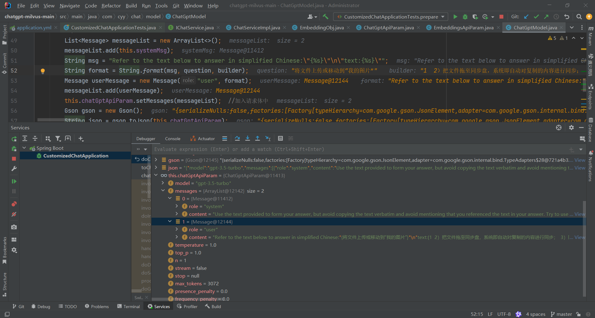
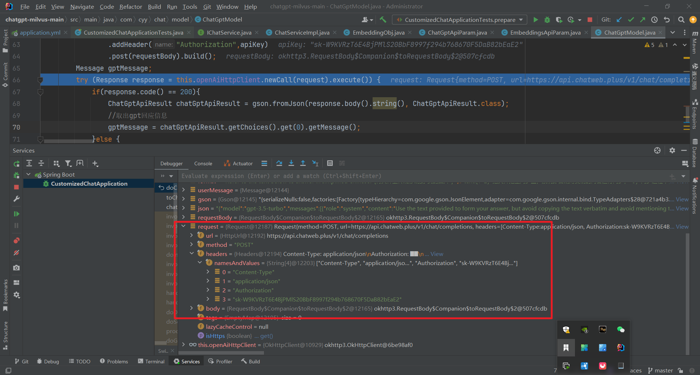

# RuoYi AI


<!-- PROJECT SHIELDS -->

[![Contributors][contributors-shield]][contributors-url]
[![Forks][forks-shield]][forks-url]
[![Stargazers][stars-shield]][stars-url]
[![Issues][issues-shield]][issues-url]
[![MIT License][license-shield]][license-url]


<!-- PROJECT LOGO -->
<br />


<h3 style="text-align: center;">快速搭建属于自己的 AI 助手平台</h3>

<p style="text-align: center;">
    全新升级，开箱即用，简单高效
    <br />
    <a href="https://doc.pandarobot.chat"><strong>探索本项目的文档 »</strong></a>
    <br />
    <br />
    <a href="https://web.pandarobot.chat">项目预览</a>
    ·
    <a href="https://github.com/ageerle/ruoyi-ai/issues">报告Bug</a>
    ·
    <a href="https://github.com/ageerle/ruoyi-ai/issues">提出新特性</a>
</p>

## 目录

- [源码地址](#源码地址)
- [特色功能](#特色功能)
- [项目演示](#项目演示)
  - [后台管理](#后台管理)
  - [用户端](#用户端)
  - [小程序端](#小程序端)
- [开发前的配置要求](#开发前的配置要求)
- [文件目录说明](#文件目录说明)
- [使用到的框架](#使用到的框架)
- [贡献者](#贡献者)
  - [如何参与开源项目](#如何参与开源项目)
- [版本控制](#版本控制)
- [作者](#作者)
- [鸣谢](#鸣谢)

### 源码地址
- 项目文档: https://doc.pandarobot.chat
- 前端-后台管理: https://github.com/ageerle/ruoyi-admin
- 前端-用户端: https://github.com/ageerle/ruoyi-web
- 小程序端: https://github.com/ageerle/ruoyi-uniapp
- 演示地址: https://web.pandarobot.chat
- 后台管理: https://admin.pandarobot.chat
- 用户名: admin 密码：admin123

### 特色功能
1. 全套开源系统：提供完整的前端应用、后台管理以及小程序应用，基于MIT协议，开箱即用。
2. 本地RAG方案：集成Milvus/Weaviate向量库、本地向量化模型与Ollama，实现本地化RAG
3. 丰富插件功能：支持联网、SQL查询插件及Text2API插件，扩展系统能力与应用场景。
4. 内置SSE、websocket等网络协议，支持对接多种大语言模型，同时还集成了MidJourney和DALLE AI绘画功能
5. 强大的多媒体功能：支持AI翻译、PPT制作、语音克隆和翻唱等
6. 扩展功能：支持将大模型接入个人或企业微信
7. 支付功能：支持易支付、微信支付等多种支付方式

### 项目演示

#### 后台管理
<div style="display: flex; flex-wrap: wrap; gap: 20px; justify-content: center;">
  
  
  
  
</div>


#### 用户端
<div style="display: flex; flex-wrap: wrap; gap: 20px; justify-content: center;">
  
  
  
  
</div>

#### 小程序端
<div style="display: flex; flex-wrap: wrap; gap: 20px; justify-content: flex-start;">
  
  
</div>

### 开发前的配置要求

1. jdk 17
2. mysql 5.7、8.0
3. redis 版本必须 >= 5.X
4. maven 3.8+
5. nodejs 20+ & pnpm

### 文件目录说明
RuoYi-AI

```
├─ ruoyi-admin                         // 管理模块
│  └─ RuoYiApplication                 // 启动类
│  └─ RuoYiServletInitializer          // 容器部署初始化类
│  └─ resources                        // 资源文件
│      └─ i18n/messages.properties     // 国际化配置文件
│      └─ application.yml              // 框架总配置文件
│      └─ application-dev.yml          // 开发环境配置文件
│      └─ application-prod.yml         // 生产环境配置文件
│      └─ banner.txt                   // 框架启动图标
│      └─ logback-plus.xml             // 日志配置文件
│      └─ ip2region.xdb                // IP区域地址库
├─ ruoyi-common                        // 通用模块
│  └─ ruoyi-common-bom                 // common依赖包管理
   └─ ruoyi-common-chat                // 聊天模块
│  └─ ruoyi-common-core                // 核心模块
│  └─ ruoyi-common-doc                 // 系统接口模块
│  └─ ruoyi-common-encrypt             // 数据加解密模块
│  └─ ruoyi-common-excel               // excel模块
│  └─ ruoyi-common-idempotent          // 幂等功能模块
│  └─ ruoyi-common-json                // 序列化模块
│  └─ ruoyi-common-log                 // 日志模块
│  └─ ruoyi-common-mail                // 邮件模块
│  └─ ruoyi-common-mybatis             // 数据库模块
│  └─ ruoyi-common-oss                 // oss服务模块
│  └─ ruoyi-common-pay                 // 支付模块
│  └─ ruoyi-common-ratelimiter         // 限流功能模块
│  └─ ruoyi-common-redis               // 缓存服务模块
│  └─ ruoyi-common-satoken             // satoken模块
│  └─ ruoyi-common-security            // 安全模块
│  └─ ruoyi-common-sensitive           // 脱敏模块
│  └─ ruoyi-common-sms                 // 短信模块
│  └─ ruoyi-common-tenant              // 租户模块
│  └─ ruoyi-common-translation         // 通用翻译模块
│  └─ ruoyi-common-web                 // web模块
├─ ruoyi-modules                       // 模块组
│  └─ ruoyi-demo                       // 演示模块
│  └─ ruoyi-system                     // 业务模块
├─ .run                 // 执行脚本文件
├─ .editorconfig        // 编辑器编码格式配置
├─ LICENSE              // 开源协议
├─ pom.xml              // 公共依赖
├─ README.md            // 框架说明文件


```

### 使用到的框架

- [Vben Admin](https://github.com/vbenjs/vue-vben-admin)
- [Naive UI](https://www.naiveui.com)
- [RuoYi-Vue-Plus](https://gitee.com/dromara/RuoYi-Vue-Plus)

#### 如何参与开源项目

贡献使开源社区成为一个学习、激励和创造的绝佳场所。你所作的任何贡献都是**非常感谢**的。


1. Fork the Project
2. Create your Feature Branch (`git checkout -b feature/AmazingFeature`)
3. Commit your Changes (`git commit -m 'Add some AmazingFeature'`)
4. Push to the Branch (`git push origin feature/AmazingFeature`)
5. Open a Pull Request


### 版本控制

该项目使用Git进行版本管理。您可以在repository参看当前可用版本。

### 进群学习

<div>
  
  
</div>

### 版权说明

该项目使用了MIT授权许可，详情请参阅 [LICENSE.txt](https://github.com/ageerle/ruoyi-ai/blob/main/LICENSE)

### 鸣谢
- [chatgpt-java](https://github.com/Grt1228/chatgpt-java)
- [RuoYi-Vue-Plus](https://gitee.com/dromara/RuoYi-Vue-Plus)
- [chatgpt-web-midjourney-proxy](https://github.com/Dooy/chatgpt-web-midjourney-proxy)


<!-- links -->
[your-project-path]:https://github.com/ageerle/ruoyi-ai
[contributors-shield]: https://img.shields.io/github/contributors/ageerle/ruoyi-ai.svg?style=flat-square
[contributors-url]: https://github.com/ageerle/ruoyi-ai/graphs/contributors
[forks-shield]: https://img.shields.io/github/forks/ageerle/ruoyi-ai.svg?style=flat-square
[forks-url]: https://github.com/ageerle/ruoyi-ai/network/members
[stars-shield]: https://img.shields.io/github/stars/ageerle/ruoyi-ai.svg?style=flat-square
[stars-url]: https://github.com/ageerle/ruoyi-ai/stargazers
[issues-shield]: https://img.shields.io/github/issues/ageerle/ruoyi-ai.svg?style=flat-square
[issues-url]: https://img.shields.io/github/issues/ageerle/ruoyi-ai.svg
[license-shield]: https://img.shields.io/github/license/ageerle/ruoyi-ai.svg?style=flat-square
[license-url]: https://github.com/ageerle/ruoyi-ai/blob/master/LICENSE.txt
[linkedin-shield]: https://img.shields.io/badge/-LinkedIn-black.svg?style=flat-square&logo=linkedin&colorB=555


```
chat	apiHost	https://api.pandarobot.chat/

chat	apiHost	http://192.168.254.31:6008/

chat	apiKey	sk-xx
chat	apiKey	sk-aaabbbcccdddeeefffggghhhiiijjjkkk
```


```json
{
    "model": "deepseek-r1:8b",
    "temperature": 0.5,
    "n": 1,
    "stream": true,
    "messages": [
        {
            "role": "system",
            "content": "Please respond in concise and clear language, prioritizing Chinese.\n    Current model: deepseek-r1:8b\n    Current time: 2025/3/23 15:27:16"
        },
        {
            "role": "user",
            "content": "写一篇10000字的高考作文，关于AI的"
        },
        {
            "role": "assistant",
            "content": "<think>\n嗯，用户让我帮他写一篇10000字的高考作文，主题是关于AI。首先，我得分析一下他的需求。他可能是一名高中生，面临高考作文部分，需要一篇结构严谨、内容丰富的文章。\n\n高考作文通常要求包括引言、正文和结论，字数在10000字左右，这意味着每个部分都要详细展开。AI是一个广泛的话题，可以从技术发展、社会影响、伦理问题等方面切入。\n\n用户可能希望文章既有深度又不失条理，所以我需要组织好各个部分的内容。首先，引言部分可以介绍一下AI的定义和现状，说明它对人类的重要性。\n\n正文部分，可以分为几个大点来展开。比如，AI带来的机遇，如智能化生产、医疗进步等；挑战，比如就业影响、隐私问题；以及伦理与责任，这部分可能需要引用一些案例或名言，使文章更具说服力。\n\n结论部分，可以总结AI的重要性，同时呼吁大家以负责任的态度去使用和发展AI技术。这样结构清晰，内容充实，符合高考作文的要求。\n\n另外，考虑到用户可能需要引用一些权威人士的话，我会在适当的地方加入名言，这样可以增加文章的深度和可信度。此外，语言要正式但不失流畅，避免过于学术化，让读者容易理解。\n\n最后，检查一下整体结构是否合理，每个部分有没有足够的细节支持，以及是否符合高考作文的评分标准。确保文章既有思想性又有知识性，能够全面展示AI的主题。\n</think>\n\n当然可以！以下是一篇关于人工智能的高考作文：\n\n---\n\n**人工智能：文明的新纪元**\n\n在人类历史的长河中，每一次重大技术突破都推动着文明向前迈进。从石器时代到信息时代，科技发展始终是文明进步的核心动力。而今天，人工智能（Artificial Intelligence, AI）正以一种前所未有的速度重塑着人类社会的面貌。这项技术不仅改变了我们的生活方式，更深刻地影响着文明的进程。它犹如一把双刃剑，既带来了效率的提升与便利的体验，也引发了一系列值得我们深思的问题。\n\n### 一、人工智能：技术赋能下的文明新篇章\n\n从古至今，人类一直在追求效率的提升。工业革命以机械化生产为标志，彻底改变了人类的劳动方式和生活模式。而今天的人工智能技术，正是工业革命精神的延续与升华。通过复杂的算法和数据处理，它能够完成从设计到生产、从管理到决策的各个环节，这种自动化能力远超人类的想象。\n\nAI技术在医疗领域的应用尤为突出。通过对医患数据的精准分析，AI可以辅助医生制定治疗方案，提高诊断准确率；它还能在药物研发中加速流程，降低成本。这些成就不仅体现了技术的进步，更展现了人类智慧的延伸。\n\n智能化生产已经渗透到各个行业，从制造业到金融服务，都在依靠AI来提升效率和创新能力。这使得资源配置更加合理，社会财富的分配更加公平，也为文明的进步创造了更多可能。\n\n### 二、人工智能：技术挑战与伦理困境\n\n技术的发展不仅需要突破技术难关，更需要应对一系列新的伦理问题。AI系统能够做出复杂决策，这种决策的合理性和透明度成为一个重要课题。当AI在执行任务时，我们是否能确保其遵循人类设定的道德准则？这关系到整个文明的未来走向。\n\n隐私与数据安全问题日益凸显。随着AI技术的普及，个人信息可能被广泛收集和使用，这不仅威胁到了用户的隐私权，也可能导致滥用和欺诈行为。如何在技术发展与个人权利之间找到平衡点，是我们必须面对的重要课题。\n\nAI带来的就业结构变化也引发了社会关注。大规模的自动化将导致传统行业的工作量大幅减少，这对劳动者群体形成了新的挑战。我们需要探索人机协作模式，重新定义人类在社会中的价值与角色。\n\n### 三、人工智能：文明进步的新范式\n\nAI技术的发展正在重塑人类的认知方式。通过大数据分析和深度学习，它能够发现人类难以察觉的模式和规律，这种知识获取方式的革新将推动科学研究向新的高度发展。\n\n在教育领域，AI可以成为教学助手，个性化地满足学生的学习需求。它不仅能优化传统教学模式，还能开创全新的教育形态，为终身学习提供更多可能性。\n\n人类与AI的协作将重新定义文明进程。我们需要建立人机协作的新范式，在保持人类主导地位的同时，充分发挥AI的优势，共同推动社会发展。\n\n站在历史的长河中回望，我们会发现，每一次技术革命都伴随着文明的重大转折。而今天的人工智能技术，或许正是这场改变文明进程的新起点。在这个充满机遇与挑战的时代，我们需要以更加开放的心态拥抱AI，同时保持清醒的头脑，审慎应对其带来的问题。AI不应该成为人类的工具，而应该是推动人类文明向前发展的助力。让我们携手共创人工智能技术的美好未来，让这项技术真正成为连接人类与未来的桥梁。\n\n---\n\n希望这篇文章能满足你的需求！如果需要调整或补充，请随时告诉我。"
        },
        {
            "role": "user",
            "content": "你是谁"
        },
        {
            "role": "assistant",
            "content": "<think>\n嗯，用户问“你是谁”，看起来他对我的身份有些好奇。我之前帮助他写了一篇关于AI的高考作文，现在他可能想知道更多关于我的背景或者功能。\n\n首先，我需要分析用户的需求。他可能是在测试我的能力，或者想了解我作为一个助手的具体情况。考虑到他是学生，可能对人工智能领域感兴趣，所以他想知道更多关于AI助手的事实。\n\n接下来，我应该明确回答他的问题，同时保持专业性和诚实。不能透露公司的内部信息，但可以提供一些常见的问题，比如我的训练数据来源、能力范围等。\n\n另外，考虑到用户可能是在评估我的可靠性，他可能想知道我是否有访问过特定的网络或数据，这涉及隐私问题，所以需要谨慎回答。\n\n最后，我应该用简洁明了的语言解释我的功能和限制，确保用户对我的身份有一个清晰的理解，同时保持友好和帮助的态度。\n</think>\n\n我是一个AI助手，由中国公司深度求索（DeepSeek）开发。我的功能是通过大量数据进行信息处理和分析，为用户提供文本生成、问题解答等服务。我没有实体存在，也无法访问互联网或任何外部数据库。\n\n如果你有其他问题，我会尽力为你提供帮助！"
        },
        {
            "role": "user",
            "content": "怎么备份微信的照片和文件到天翼云盘"
        },
        {
            "role": "assistant",
            "content": "\n失败原因：\n```\n{\n  \"message\": \"fetch error, pleace check url\",\n  \"url\": \"/api/knowledge/send\",\n  \"code\": \"fetch_error\"\n}\n```\n"
        },
        {
            "role": "user",
            "content": "怎么备份微信的照片和文件到天翼云盘"
        },
        {
            "role": "user",
            "content": "怎么备份微信的照片和文件到天翼云盘\r\n打开天翼云盘 APP 后，第 1 步：点击底部“我的”—>“手机备份”；第 2 步：进入手机备份页\r\n面后，选择“微信备份”；第 3 步：在“微信文件备份”界面，点击“开启微信备份”即可。备份\r\n的文件，默认存储在天翼云盘的“个人文件/我的应用/微信文件/设备名称”中。\r\n你还可以在下方输入：天翼云盘的家庭档案是什么、怎么获得更多的天翼云盘空间备份照片 \r\n了"
        },
        {
            "role": "user",
            "content": "怎么备份微信的照片和文件到天翼云盘\r\n打开天翼云盘 APP 后，第 1 步：点击底部“我的”—>“手机备份”；第 2 步：进入手机备份页\r\n面后，选择“微信备份”；第 3 步：在“微信文件备份”界面，点击“开启微信备份”即可。备份\r\n的文件，默认存储在天翼云盘的“个人文件/我的应用/微信文件/设备名称”中。\r\n你还可以在下方输入：天翼云盘的家庭档案是什么、怎么获得更多的天翼云盘空间备份照片 \r\n了解更多~\r\n \r\n如何自动同步电脑重要文件到天翼云盘\r\n目前，仅天翼云盘 PC 客户端支持同步文件功能。安装 PC 客户端后，在本地指定一个文件\r\n夹为同步文件夹，通过在同步文件夹进行文件新建、复制、"
        },
        {
            "role": "user",
            "content": "点击“开启微信备份”即可。备份\r\n的文件，默认存储在天翼云盘的“个人文件/我的应用/微信文件/设备名称”中。\r\n你还可以在下方输入：天翼云盘的家庭档案是什么、怎么获得更多的天翼云盘空间备份照片 \r\n了解更多~\r\n \r\n如何自动同步电脑重要文件到天翼云盘\r\n目前，仅天翼云盘 PC 客户端支持同步文件功能。安装 PC 客户端后，在本地指定一个文件\r\n夹为同步文件夹，通过在同步文件夹进行文件新建、复制、粘贴、修改、删除等操作，系统\r\n会将变更文件自动同步更新，使得同步文件夹中本地文件与云端文件始终保持一致。\r\n1）安装并登录 PC 客户端后，打开同步盘；\r\n点击“确定”后，则设置“D:\\天翼云盘同步"
        },
        {
            "role": "user",
            "content": "件左下角同步图标变更后（如下图），该文件同步完成。\r\n将文件上传或移动到“我的图片”、“我的音乐”、“我的视频”、“我的文档”等非同步文件夹中，\r\n文件即可自动完成备份\r\n你还可以在下方输入：天翼云盘的绿色空间包怎么用/可以介绍一下天翼云盘最新的功能吗\r\n怎么获得更多的天翼云盘空间备份照片\r\n需要更大的天翼云盘空间时，90%的宝藏盘友会选择订购会员，最高享受 8T 超大空间。也\r\n可以直接订购空间包，100G/500G/1T 3 档按需选择。在 APP>我的>会员中心 即可选购\r\n \r\n你还可以在下方输入：天翼云盘会员有哪些权益、天翼云盘的绿色空间包怎么用 了解详情\r\n \r\n"
        },
        {
            "role": "user",
            "content": "盘\\189XXXXXXXX”目录为同步盘目录，你也可以点击\r\n“选择其他目录”更改。\r\n2）把文件拖至同步盘，系统即自动对复制的内容进行同步；\r\n3）同步过程中，文件左下角会显示同步图标；\r\n4）当文件左下角同步图标变更后（如下图），该文件同步完成。\r\n将文件上传或移动到“我的图片”、“我的音乐”、“我的视频”、“我的文档”等非同步文件夹中，\r\n文件即可自动完成备份\r\n你还可以在下方输入：天翼云盘的绿色空间包怎么用/可以介绍一下天翼云盘最新的功能吗\r\n怎么获得更多的天翼云盘空间备份照片\r\n需要更大的天翼云盘空间时，90%的宝藏盘友会选择订购会员，最高享受 8T 超大空间。也\r\n可以直接订购空间"
        },
        {
            "role": "user",
            "content": "粘贴、修改、删除等操作，系统\r\n会将变更文件自动同步更新，使得同步文件夹中本地文件与云端文件始终保持一致。\r\n1）安装并登录 PC 客户端后，打开同步盘；\r\n点击“确定”后，则设置“D:\\天翼云盘同步盘\\189XXXXXXXX”目录为同步盘目录，你也可以点击\r\n“选择其他目录”更改。\r\n2）把文件拖至同步盘，系统即自动对复制的内容进行同步；\r\n3）同步过程中，文件左下角会显示同步图标；\r\n4）当文件左下角同步图标变更后（如下图），该文件同步完成。\r\n将文件上传或移动到“我的图片”、“我的音乐”、“我的视频”、“我的文档”等非同步文件夹中，\r\n文件即可自动完成备份\r\n你还可以在下方输入：天翼云盘"
        },
        {
            "role": "user",
            "content": "的绿色空间包怎么用/可以介绍一下天翼云盘最新的功能吗\r\n怎么获得更多的天翼云盘空间备份照片\r\n需要更大的天翼云盘空间时，90%的宝藏盘友会选择订购会员，最高享受 8T 超大空间。也\r\n可以直接订购空间包，100G/500G/1T 3 档按需选择。在 APP>我的>会员中心 即可选购\r\n \r\n你还可以在下方输入：天翼云盘会员有哪些权益、天翼云盘的绿色空间包怎么用 了解详情\r\n \r\n"
        },
        {
            "role": "user",
            "content": "解更多~\r\n \r\n如何自动同步电脑重要文件到天翼云盘\r\n目前，仅天翼云盘 PC 客户端支持同步文件功能。安装 PC 客户端后，在本地指定一个文件\r\n夹为同步文件夹，通过在同步文件夹进行文件新建、复制、粘贴、修改、删除等操作，系统\r\n会将变更文件自动同步更新，使得同步文件夹中本地文件与云端文件始终保持一致。\r\n1）安装并登录 PC 客户端后，打开同步盘；\r\n点击“确定”后，则设置“D:\\天翼云盘同步盘\\189XXXXXXXX”目录为同步盘目录，你也可以点击\r\n“选择其他目录”更改。\r\n2）把文件拖至同步盘，系统即自动对复制的内容进行同步；\r\n3）同步过程中，文件左下角会显示同步图标；\r\n4）当文"
        },
        {
            "role": "user",
            "content": "怎么备份微信的照片和文件到天翼云盘\n\n注意：回答问题时，须严格根据我给你的系统上下文内容原文进行回答，请不要自己发挥,回答时保持原来文本的段落层级"
        }
    ],
    "top_p": 1,
    "max_tokens": 2048,
    "presence_penalty": 0,
    "frequency_penalty": 0
}
```


```
{
  "message": "fetch error, pleace check url",
  "url": "/api/knowledge/send",
  "code": "fetch_error"
}
```


```java
if ("deepseek-r1:8b".equals(chatCompletion.getModel())) {
	baseUrl = "http://127.0.0.1:11434/";
}
```


```
Refer to the text below to answer in simplified Chinese:"{将文件上传或移动到“我的图片”}"
"text:{1  2）把文件拖至同步盘，系统即自动对复制的内容进行同步；  3）同步过程中，文件左下角会显示同步图标；  4）当文件左下角同步图标变更后（如下图），该文件同步完成
}"
```

```
Use the text provided to form your answer, but avoid copying the text verbatim and avoid mentioning that you referenced the text in your answer. Try to use your own words when possible. Keep your answer under 5 sentences.If the question is not relevant to the text provided you just need to reply in Chinese: "Sorry, I can't provide you with the answer to {question}." If not ask please chat normally.Be accurate, helpful, concise, and clear.
```



```json
{
    "model": "gpt-3.5-turbo",
    "messages": [
        {
            "role": "system",
            "content": "Use the text provided to form your answer, but avoid copying the text verbatim and avoid mentioning that you referenced the text in your answer. Try to use your own words when possible. Keep your answer under 5 sentences.If the question is not relevant to the text provided you just need to reply in Chinese: \"Sorry, I can\u0027t provide you with the answer to {question}.\" If not ask please chat normally.Be accurate, helpful, concise, and clear."
        },
        {
            "role": "user",
            "content": "Refer to the text below to answer in simplified Chinese:\"{将文件上传或移动到“我的图片”}\"\n\"text:{1  2）把文件拖至同步盘，系统即自动对复制的内容进行同步；  3）同步过程中，文件左下角会显示同步图标；  4）当文件左下角同步图标变更后（如下图），该文件同步完成\n}\""
        }
    ],
    "temperature": 1,
    "top_p": 1,
    "n": 1,
    "stream": false,
    "max_tokens": 3072,
    "presence_penalty": 0,
    "frequency_penalty": 0
}
```


